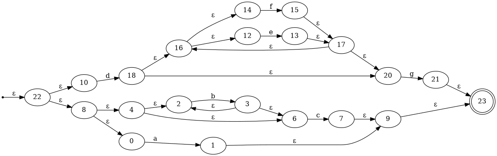
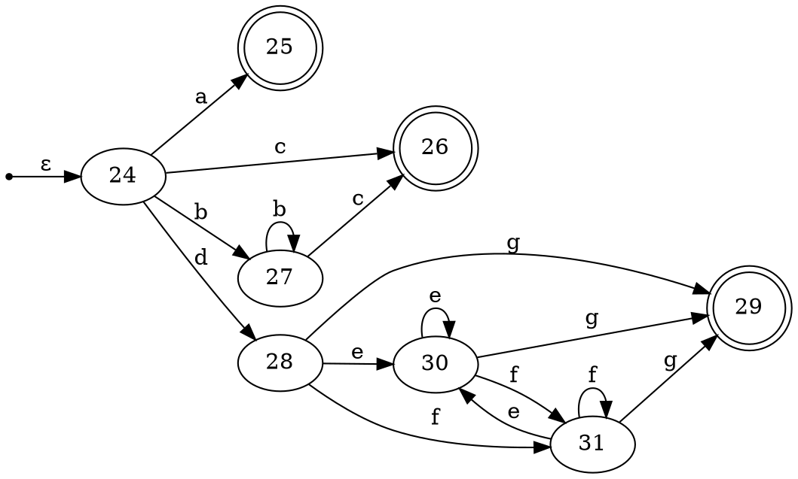
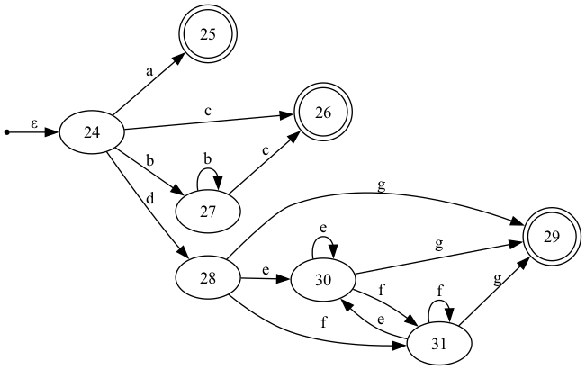
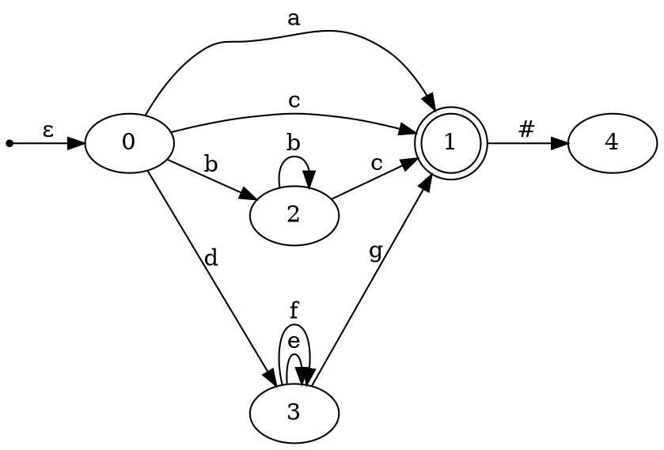
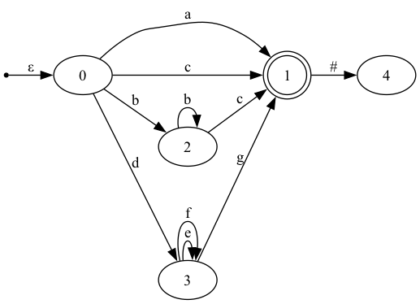

# Danpiler
Compilers : Principles, Techniques &amp; Tools 를 읽고 어휘 분석기부터 중간 코드 생성과 코드 최적화까지 가능한 만큼 직접 구현해봅니다. 그이름하야 단파일러 프로젝트


## 어휘분석기

### NFA
**정규식**을 입력받아 이를 **NFA (Nondeterministic Finite Automaton)**로 변환하고, 이를 그래픽적으로 시각화할 수 있습니다.

입력된 정규식을 [NFA](src/main/kotlin/NFA.kt)로 변환할 수 있습니다. 변환한 NFA 로 정규식 매칭을 할 수 있고 [NFATest.kt](src/test/kotlin/NFATest.kt) 를 참조하세요.

변환된 NFA는 **Dot 파일** 형식으로 출력되고, 이를 **Graphviz**를 사용하여 그래프 형태로 시각화할 수 있습니다.

#### 동작 예시
#### 1. 정규식 → NFA 변환

입력 정규식:"a|b*c|d(e|f)*g"
#### 2. NFA Graph

변환된 NFA를 **Dot 파일**로 출력하고, 이를 Graphviz를 사용하여 시각화한 이미지입니다. Dot 파일의 내용은 다음과 같습니다:
( toDot 함수로 출력가능 )


위의 Dot 파일을 Graphviz로 시각화한 결과는 다음과 같습니다:

#### ( ε 은 빈 문자 간선 )


#### 3. NFA 그래프 출력
위의 Dot 파일을 Graphviz를 사용하여 NFA 그래프를 생성할 수 있습니다. 예시로 nfa.dot 파일을 사용하여 NFA 그래프를 PNG 이미지로 생성하는 방법은 다음과 같습니다:
```
dot -Tpng nfa.dot -o nfa_graph.png
```
이 명령어를 실행하면 nfa_graph.png라는 이미지 파일이 생성됩니다.


### DFA
**정규식**을 입력받아 생성된 **NFA**를 **DFA (Deterministic Finite Automaton)**로 변환하고, 이를 그래픽적으로 시각화할 수 있습니다.
DFA는 NFA에 비해 더 효율적으로 정규식을 매칭할 수 있으며, 불필요한 상태를 제거하여 최적화된 상태로 동작합니다.


#### 동작 예시
##### 1. NFA → DFA 변환

입력된 NFA를 기반으로 DFA를 생성합니다. ( toDFA 함수 )
다음은 변환된 DFA의 Dot 파일 예시입니다:

입력 정규식:"a|b*c|d(e|f)*g" ( NFA 예시와 동일 )



위의 Dot 파일을 Graphviz로 시각화한 결과는 다음과 같습니다: ( NFA 와 비교할 때 Node 숫자 24 -> 8 개로 66% 감소 )



### Direct DFA
**정규식**을 입력받아 NFA 를 거치지 않고 곧바로 DFA (Deterministic Finite Automaton)**를 생성합니다.

#### 동작 예시
##### 1. 정규식 -> DFA 변환

DFA.toDirectDFA 함수를 이용해 정규식을 곧바로 DFA 로 변환합니다.
NFA -> DFA 로 변환하는 방식보다 더 적은 상태를 가집니다.

입력 정규식:"a|b*c|d(e|f)*g" ( NFA 예시와 동일 )



위의 Dot 파일을 Graphviz로 시각화한 결과는 다음과 같습니다: ( NFA->DFA 와 비교할 때 Node 숫자 8 -> 5 개로 37% 감소 )


### Tokenizing


