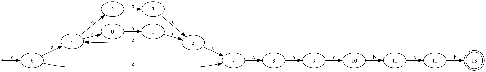
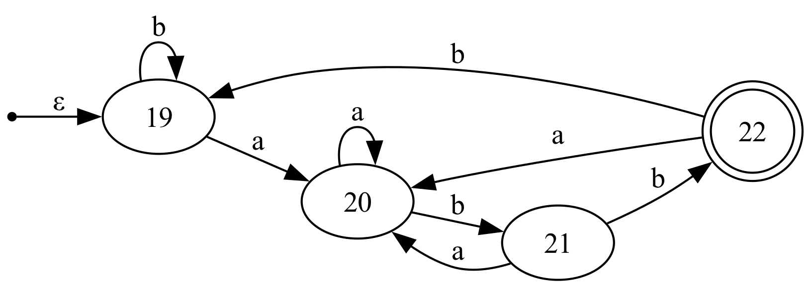

# Danpiler
This is the Danpiler project, where I implement everything from lexical analysis to intermediate code generation and optimization based on "Compilers: Principles, Techniques & Tools."

## Lexical Analyzer

### NFA
Given a **regular expression**, it is converted into an **NFA (Nondeterministic Finite Automaton)**, which can then be visualized graphically.

The input regular expression can be converted into an [NFA](src/main/kotlin/NFA.kt). The resulting NFA can be used for regular expression matching. Refer to [NFATest.kt](src/test/kotlin/tc/NFATest.kt) for details.

#### Example: Regular Expression `(a|b)*abb`
NFA construction process and result:


### DFA
A given **regular expression** is converted into an **NFA** and then transformed into a **DFA (Deterministic Finite Automaton)**, which can be visualized graphically.
DFA provides more efficient regular expression matching than NFA by minimizing unnecessary states.

#### Example: Conversion from NFA to DFA
DFA transformation process and result:


### Direct DFA
A **regular expression** is converted directly into a DFA without passing through an NFA. This approach can result in fewer states compared to the traditional NFA-to-DFA transformation.

---

## **Parser Implementation (LR(0) → SLR(1))**

### **1. LR(0) Automaton Generation**
A given BNF grammar is converted into an **LR(0) automaton**.  
Each state and transition can be visualized graphically,  
and the automaton can be examined using DOT (Graphviz) output.

- `closure()` is used to **compute LR(0) state sets**.
- `goto()` is used to **construct state transitions**.

### **2. SLR(1) Extension**
SLR(1) parsing extends the **LR(0) parser by incorporating FollowSet** to reduce conflicts.
Using [FirstFollowCalculator](src/main/kotlin/parser/parserUtils.kt), **First/Follow sets are computed**,
allowing for a more refined parsing process by resolving Shift/Reduce conflicts.

#### Example: SLR(1) Parsing Process
To illustrate how the SLR(1) parser works, we use a simple arithmetic expression grammar:

```
<E> ::= <E> "+" <T> | <T>
<T> ::= <T> "*" <F> | <F>
<F> ::= "(" <E> ")" | "id"
```

The following is the SLR(1) state graph based on this grammar:


### **3. Action & Goto Table Construction**
SLR(1) parsing operates based on **Action / Goto tables**.  
It determines **Shift, Reduce, Accept, and Error actions** based on the current state and input.

```kotlin
override fun action(s: Int, terminalItem: TerminalItem): Action {
        var j = goto[s to terminalItem]
        if(j != null) {
            return Action.Shift(j)
        }

        // j is null
        val c = lr0CollectionMap[s]!!

        val reduceItems = c.items.filter { it.dotIndex == it.production.size &&
                firstFollowCalculator.getFollowSet(it.nonTerminal).contains(terminalItem)
        }
        if(reduceItems.size > 1) {
            throw IllegalArgumentException("grammar is not SLR(1)")
        }

        val reduceItem = reduceItems.firstOrNull()

        if(reduceItem != null) {
            if(reduceItem.nonTerminal == NonTerminalItem(root.name + "`")){
                return Action.Accept
            }
            return Action.Reduce(reduceItem.nonTerminal, reduceItem.production)
        }

        j = goto[Pair(s, emptyTerminalItem)]
        if(j != null) {
            return Action.EmptyShift(j)
        }

        return Action.Error
    }
```
This function handles **Shift, Reduce, Accept, and Error actions**,  
and SLR(1) parsing determines Reduce actions based on FollowSet.

### **4. Testing & Validation**
SLR(1) parsing is tested against various grammars to ensure correctness.  
Refer to [SLRParserTest.kt](src/test/kotlin/tc/SLRParserTest.kt) for test cases.

#### ✅ **Test Cases**
- **Simple grammar test**
- **Expression grammar test**
- **Control flow (if, while) test**
- **Class/function declaration test to verify complex grammar parsing**