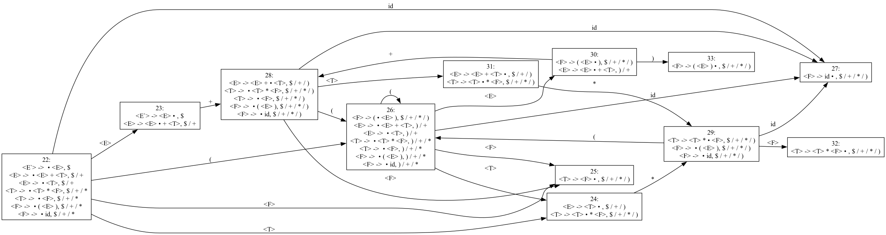

# Danpiler
This is the Danpiler project, where I implement everything from lexical analysis to intermediate code generation and optimization based on "Compilers: Principles, Techniques & Tools."

## Lexical Analyzer

### NFA
Given a **regular expression**, it is converted into an **NFA (Nondeterministic Finite Automaton)**, which can then be visualized graphically.

The input regular expression can be converted into an [NFA](src/main/kotlin/NFA.kt). The resulting NFA can be used for regular expression matching. Refer to [NFATest.kt](src/test/kotlin/tc/NFATest.kt) for details.

#### Example: Regular Expression `(a|b)*abb`
NFA construction process and result:


### DFA
A given **regular expression** is converted into an **NFA** and then transformed into a **DFA (Deterministic Finite Automaton)**, which can be visualized graphically.
DFA provides more efficient regular expression matching than NFA by minimizing unnecessary states.

#### Example: Conversion from NFA to DFA
DFA transformation process and result:


### Direct DFA
A **regular expression** is converted directly into a DFA without passing through an NFA. This approach can result in fewer states compared to the traditional NFA-to-DFA transformation.

---

## **Parser Implementation (LR(0) → SLR(1) → LR(1) → LALR(1))**

### **1. LR(1) Parsing Implementation**
LR(1) parsing extends SLR(1) by incorporating **Lookahead symbols**, allowing for more precise parsing decisions.
This approach prevents conflicts that occur in SLR(1) when FollowSets are not sufficient.

#### Example: LR(1) Parsing State Graph
To demonstrate LR(1) parsing, the following expression grammar is used:

```
<E> ::= <E> "+" <T> | <T>
<T> ::= <T> "*" <F> | <F>
<F> ::= "(" <E> ")" | "id"
```

Generated LR(1) state graph:


The LR(1) parsing state graph contains a large number of states, making it complex and difficult to interpret.

### **2. LALR(1) Optimization**
Although LR(1) parsing is powerful, it introduces a large number of states due to its use of Lookaheads.
LALR(1) parsing optimizes this by merging LR(1) states that share the same LR(0) core while combining Lookaheads.

This allows for a more efficient parsing table while maintaining LR(1) parsing accuracy.

#### Example: LALR(1) Parsing State Graph

As you can see, the number of states is significantly reduced.

### **3. Action & Goto Table Construction**
LALR(1) operates using **compressed LR(1) tables**, maintaining strong parsing capabilities while reducing state complexity.

```kotlin
override fun action(s: Int, terminalItem: TerminalItem): Action {
    var j = goto[s to terminalItem]
    if (j != null) {
        return Action.Shift(j)
    }

    val c = lr1CollectionMap[s]!!
    val reduceItems = c.items.filter { it.dotIndex == it.production.size &&
            it.lookAhead.contains(terminalItem)
    }
    if (reduceItems.size > 1) {
        throw IllegalArgumentException("grammar is not LALR(1)")
    }

    val reduceItem = reduceItems.firstOrNull()

    if (reduceItem != null) {
        if (reduceItem.nonTerminal == NonTerminalItem(root.name + "`") && terminalItem == endTerminalItem) {
            return Action.Accept
        }
        return Action.Reduce(reduceItem.nonTerminal, reduceItem.production)
    }

    return Action.Error
}
```
This function enables **Shift, Reduce, Accept, and Error actions** efficiently in the LALR(1) parsing model.

### **4. Testing & Validation**
LALR(1) parsing has been thoroughly tested to validate its correctness across different grammars.
Refer to [LALRParserTest.kt](src/test/kotlin/tc/LALRParserTest.kt) for test cases.

#### ✅ **Test Cases**
- **Simple grammar test**
- **Expression grammar test**
- **Control flow (if, while) test**
- **Class/function declaration test to verify complex grammar parsing**

